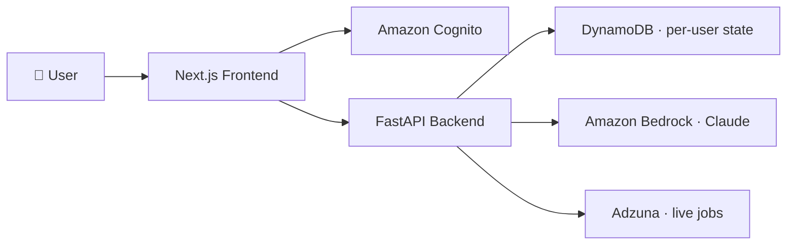
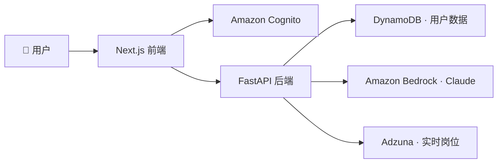
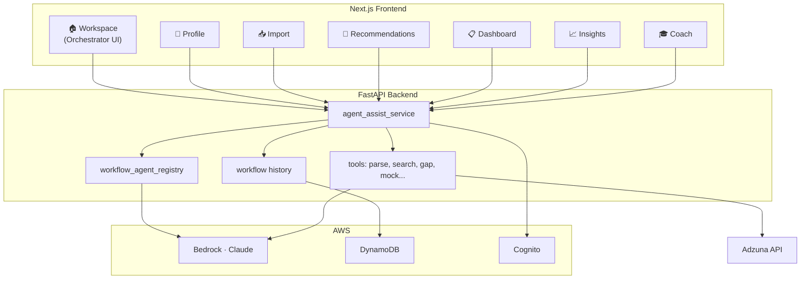

<div align="center">

# 🐱 CareerCat

### Your Agentic AI Job-Search Workspace

**[English](#english) · [中文](#中文)**

[](https://main.d2taej5h07fd9k.amplifyapp.com)
[](https://feature-v2-upgrade.d2taej5h07fd9k.amplifyapp.com)

[](https://nextjs.org)
[](https://fastapi.tiangolo.com)
[](https://aws.amazon.com/bedrock/)
[](https://aws.amazon.com/cognito/)
[](https://aws.amazon.com/dynamodb/)
[](#)

**Author:** Zhiqi Zhang · **Stack:** Next.js + FastAPI + Amazon Bedrock + DynamoDB + Cognito + Adzuna

> One workspace. One orchestrator. Seven specialist agents.
> 一个工作台、一个总调度、七个专项 Agent，让杂乱的求职过程变成有节奏的流水线。

---

### 🚀 Try the new v2 preview

```
https://feature-v2-upgrade.d2taej5h07fd9k.amplifyapp.com
```

</div>

---

## English

### 🌟 What is CareerCat?

CareerCat is an **agentic AI job-search assistant** that turns a messy, multi-step job search into a single account-based workspace. You don't copy-paste between Notion, spreadsheets, LinkedIn tabs, ChatGPT, and an interview prep doc anymore — CareerCat's **Workflow Orchestrator** reads your goal and dispatches the right specialist agent for every step.



### ✨ What makes it different — the **Agent Harness**

The home page is **not a chatbot** and **not a fixed pipeline**. It is an orchestrator that:

1. **Reads intent** from a natural-language request.
2. **Checks data sufficiency** — does it have your resume? a target job? saved applications?
3. **Picks one** of seven specialist subagents to handle the next step.
4. **Plans a 2-5 step todo list** of user-visible platform actions, with `depends_on` ordering.
5. **Surfaces 2-4 suggested next actions** as routed buttons, so the next click is always one tap away.
6. **Persists every workflow** in DynamoDB so users can resume on any device.

#### The 7 specialist subagents

| Agent | Owns | Lands you on | Tool |
| --- | --- | --- | --- |
| 🧾 **Profile Agent** | Resume parsing, skills, target roles, sponsorship | `/profile` | `go_to_profile` |
| 🔎 **Job Search Agent** | Fresh discovery on Adzuna with role / location / recency / visa filters | `/recommendations` | `search_adzuna_jobs` |
| 📥 **Job Parser Agent** | Pasted JD → structured fields (title, company, salary, skills, sponsorship signal) | `/import-jobs` | `parse_job_post` |
| 🧩 **Fit Agent** | Profile-vs-job gap analysis, tailoring, prioritization | `/coach` | `start_gap_analysis` |
| 📋 **Tracker Agent** | Saved jobs, application status, dates, notes — Kanban + List | `/dashboard` | `view_dashboard` |
| 📈 **Insights Agent** | Funnel health, response rates, weekly retrospectives | `/insights` | `view_insights` |
| 🎓 **Coach Agent** | Technical + behavioral mocks, written assessments, SQL/Python drills | `/coach` | `start_mock_interview` |

#### Design principles

- **Domain ownership** — each subagent only acts within its domain. A Fit Agent will refuse to answer if either the resume or the job description is missing; it creates a `/profile` or `/import-jobs` todo instead.
- **Anti-hallucination guardrails** — the orchestrator never invents resume facts, saved jobs, company names, or application statuses. Missing inputs become explicit platform todos.
- **Routing transparency** — every subagent has a fixed UI route, so the agent always knows *where* to send you, not just *what* to say.
- **Compact platform todos** — only user-actionable steps surface in the UI. Internal handoffs ("coordinate harness", "understand goal") stay hidden.
- **Suggested actions, not free chat** — the orchestrator returns vertical-choice buttons that map to real CareerCat routes, eliminating the "what do I do next?" gap.
- **Stateful workflows** — every conversation is saved with its plan, todos, and completed steps, so users can resume any past workflow from the sidebar.

### 🎯 Feature highlights

| | |
| --- | --- |
| 🧠 **Multi-stage Workflow Agent** — One input → a planned, ordered, routed plan. | 🗂️ **Kanban + List Dashboard** — Toggle views, persisted per user. |
| 📄 **AI Resume Parsing** — Upload → structured profile → editable → saved. | 📌 **One-paste Job Import** — Pasted JD becomes a typed job card with sponsorship signal. |
| 🌐 **Live Job Recommendations** — Adzuna search with visa-aware filtering. | 📊 **Application Insights** — Funnel, response rate, weekly retrospective. |
| 🎤 **AI Career Coach** — Gap analysis · mock interview · written assessment. | 💻 **Language-aware Coach Code** — Python · SQL · JS/TS · JSON · Bash · Java · C++ · Go · Rust · YAML and more. |
| 🛂 **Sponsorship-aware Pipeline** — Warns on jobs that don't support sponsorship. | ☁️ **Cloud Workflow History** — Resume any past workflow from any device. |
| 🌏 **Bilingual UI (EN / 中文)** — Agent output adapts to user locale. | 🔭 **Internal Observability** — Latency, tool selection, input/output per run. |

---

## 中文

### 🌟 CareerCat 是什么？

CareerCat 是一款 **Agentic AI 求职工作台**。它把投简历、找岗、做对照、追踪进度、模拟面试这些原本散落在 Notion、Excel、LinkedIn、ChatGPT、面经文档里的步骤，**整合到一个账户体系下**。你只需要把目标说清楚，**总调度 Agent（Workflow Orchestrator）** 会自动选最合适的专项 Agent 接手下一步。



### ✨ 核心亮点：Agent Harness 多智能体编排

工作台首页**不是聊天框**、**也不是固定流水线**，而是一个总调度，它会：

1. **识别意图** —— 从你的自然语言请求里抽出真正想做的事
2. **检查数据是否充分** —— 有没有简历？有没有目标岗位？有没有保存的投递记录？
3. **选择一个专项 Agent** —— 从 7 个子 Agent 里挑一个最合适的接手
4. **生成 2–5 步的平台 todo** —— 每一步都带 `depends_on` 依赖顺序
5. **推 2–4 个建议下一步** —— 渲染成纵向按钮，下一步永远只差一次点击
6. **持久化整段工作流** —— 写入 DynamoDB，换设备也能续上

#### 7 个专项子 Agent

| Agent | 负责 | 落地页 | 工具 |
| --- | --- | --- | --- |
| 🧾 **Profile Agent** | 简历解析、技能、目标岗、签证偏好 | `/profile` | `go_to_profile` |
| 🔎 **Job Search Agent** | Adzuna 实时岗位发现，按角色/地点/时效/签证过滤 | `/recommendations` | `search_adzuna_jobs` |
| 📥 **Job Parser Agent** | 粘贴的 JD → 结构化字段（公司、薪资、技能、签证信号） | `/import-jobs` | `parse_job_post` |
| 🧩 **Fit Agent** | 简历-岗位差距分析、定制化建议、优先级排序 | `/coach` | `start_gap_analysis` |
| 📋 **Tracker Agent** | 投递管理、状态、日期、备注 —— 看板 + 列表两种视图 | `/dashboard` | `view_dashboard` |
| 📈 **Insights Agent** | 投递漏斗、回复率、瓶颈、周度复盘 | `/insights` | `view_insights` |
| 🎓 **Coach Agent** | 技术 + 行为面试、笔试、SQL/Python 训练 | `/coach` | `start_mock_interview` |

#### 设计原则

- **领域专属（Domain Ownership）** —— 子 Agent 只在自己的领域里行动。Fit Agent 如果发现简历或 JD 缺失，**不会瞎猜**，而是创建一个 `/profile` 或 `/import-jobs` 平台 todo，让用户先补齐。
- **反幻觉护栏（Anti-hallucination Guardrails）** —— 总调度从不编造简历事实、岗位信息或投递状态；缺什么就明确建一个平台 todo 让用户补。
- **路由透明（Routing Transparency）** —— 每个子 Agent 都有固定 UI 路由，Agent 永远知道**把用户带到哪个页面**，而不是只会说话。
- **平台 Todo 简洁化** —— UI 上只暴露**用户需要做的动作**，内部交接（"理解目标"、"协调 harness"）全部隐藏。
- **建议动作而非自由对话** —— Agent 返回带路由的纵向按钮，彻底消灭"下一步该干嘛"的卡顿。
- **有状态工作流** —— 每段对话连同计划、todo、完成步骤一起保存，侧边栏点一下就能继续上次的流程。

### 🎯 功能矩阵

| | |
| --- | --- |
| 🧠 **多阶段工作流 Agent** —— 一句话 → 一份带依赖关系的可执行计划。 | 🗂️ **Kanban + 列表 Dashboard** —— 视图切换 + 用户级偏好持久化。 |
| 📄 **AI 简历解析** —— 上传 → 结构化字段 → 可编辑 → 一键保存。 | 📌 **粘贴即导入岗位** —— JD 粘贴自动转结构化卡片，附带签证信号。 |
| 🌐 **实时岗位推荐** —— Adzuna 搜索 + 签证感知过滤。 | 📊 **投递进度 Insights** —— 漏斗、回复率、瓶颈识别、周度复盘。 |
| 🎤 **AI 求职教练** —— 差距分析 · 模拟面试 · 笔试训练。 | 💻 **语言感知代码渲染** —— Python · SQL · JS/TS · JSON · Bash · Java · C++ · Go · Rust · YAML 等。 |
| 🛂 **签证敏感流程** —— 遇到不 sponsor 的岗位主动提醒。 | ☁️ **云端工作流历史** —— 跨设备续上任何一段工作流。 |
| 🌏 **中英双语 UI** —— Agent 输出按用户 locale 自适应。 | 🔭 **内部可观测性** —— 每次工具调用的延迟、入参、出参全部留痕。 |

---

## 🏗️ Architecture Overview · 架构总览



---

## 🚀 Quick Start · 快速开始

> Tested with Node.js 20+ and Python 3.11+.

```bash
# 1. clone
git clone https://github.com/zhiqi-zhang233/CareerCat.git
cd CareerCat

# 2. backend
cd careercat-backend
python -m venv venv && source venv/bin/activate
pip install -r requirements.txt
cp .env.example .env          # fill in AWS creds, Adzuna creds
uvicorn app.main:app --reload --port 8000

# 3. frontend (new terminal)
cd ../careercat-frontend
npm install
cp .env.example .env.local    # point NEXT_PUBLIC_API_BASE_URL at the backend
npm run dev
# open http://localhost:3000
```

**Local-only mode** — set `AUTH_MODE=local` in the backend `.env` to skip Cognito and use a browser-generated test user id. Bedrock, DynamoDB, and Adzuna are still required for AI parsing, recommendations, and persistence.

---

## ⚙️ Environment Variables · 环境变量

### Backend (`careercat-backend/.env`)

```env
AWS_REGION=us-east-2
BEDROCK_REGION=us-east-2
BEDROCK_MODEL_ID=anthropic.claude-3-haiku-20240307-v1:0
DYNAMODB_USER_PROFILES_TABLE=UserProfiles
DYNAMODB_JOB_POSTS_TABLE=JobPosts
DYNAMODB_AGENT_RUNS_TABLE=AgentRuns
DYNAMODB_COACH_SESSIONS_TABLE=CoachSessions
DYNAMODB_WORKFLOW_HISTORY_TABLE=WorkflowHistory     # v2
ADZUNA_APP_ID=...
ADZUNA_APP_KEY=...
ADZUNA_COUNTRY=us
AUTH_MODE=cognito
COGNITO_REGION=us-east-2
COGNITO_USER_POOL_ID=...
COGNITO_APP_CLIENT_ID=...
CORS_ALLOWED_ORIGINS=https://main.d2taej5h07fd9k.amplifyapp.com,https://feature-v2-upgrade.d2taej5h07fd9k.amplifyapp.com,http://localhost:3000
```

### Frontend (`careercat-frontend/.env.local`)

```env
NEXT_PUBLIC_API_BASE_URL=https://your-backend-url
NEXT_PUBLIC_AUTH_MODE=cognito
NEXT_PUBLIC_COGNITO_REGION=us-east-2
NEXT_PUBLIC_COGNITO_USER_POOL_ID=...
NEXT_PUBLIC_COGNITO_APP_CLIENT_ID=...
```

---

## ☁️ Deployment · 部署

CareerCat is designed to run on AWS:

| Layer | Service |
| --- | --- |
| Frontend | **AWS Amplify Hosting** (one app, multiple branches → multiple URLs) |
| Backend | **AWS App Runner** (Docker image from ECR) |
| Auth | **Amazon Cognito** User Pool + App Client |
| Database | **Amazon DynamoDB** (UserProfiles, JobPosts, AgentRuns, CoachSessions, WorkflowHistory) |
| LLM | **Amazon Bedrock** (Claude family) |
| Jobs | **Adzuna API** |
| Registry | **Amazon ECR** (if image-based backend) |

### Live URLs

| Branch | URL |
| --- | --- |
| `main` (production) | https://main.d2taej5h07fd9k.amplifyapp.com |
| `feature/v2-upgrade` (v2 preview) | https://feature-v2-upgrade.d2taej5h07fd9k.amplifyapp.com |

### Frontend on Amplify

The repository root `amplify.yml` already targets `careercat-frontend` as the app root and outputs `.next`. To preview a new branch:

1. Amplify Console → **Connect a branch** → pick the branch
2. Copy the same env vars from `main`, overriding `NEXT_PUBLIC_API_BASE_URL` if pointing at a separate backend
3. **Save and deploy** → Amplify will give you a per-branch URL

### Backend on App Runner

`careercat-backend/` ships with both a `Dockerfile` and an `apprunner.yaml`. Either build to ECR and deploy from there, or use App Runner's source-based deploy with the YAML.

The runtime role needs:

- `bedrock:InvokeModel` / `InvokeModelWithResponseStream`
- DynamoDB `GetItem / PutItem / UpdateItem / Query / DeleteItem` on the configured tables
- ECR pull permission if image-based

### Cognito Tips

- Use a **public app client** without a secret for browser-based login
- For development, **Gmail addresses** receive Cognito verification codes most reliably
- Set `NEXT_PUBLIC_AUTH_MODE=cognito` and `AUTH_MODE=cognito` once production-style auth is in place

---

## 📁 Repository Structure · 仓库结构

```text
CareerCat/
├── amplify.yml                         # monorepo build spec (frontend root)
├── README.md                           # this file
├── docs/
│   ├── careercat-architecture-and-implementation.md   # full engineering handoff doc
│   └── index.html
├── careercat-backend/                  # FastAPI + Bedrock + DynamoDB
│   ├── app/
│   │   ├── main.py                     # routers + CORS
│   │   ├── auth.py                     # local mode + Cognito JWT verification
│   │   ├── routers/                    # /agent /workflows /coach /jobs /profile ...
│   │   ├── schemas/                    # Pydantic models
│   │   └── services/
│   │       ├── agent_assist_service.py        # 🧠 orchestrator + multi-stage planning
│   │       ├── workflow_agent_registry.py     # 🧩 7 specialist subagents + prompts
│   │       ├── bedrock_service.py             # Bedrock client + structured parsing
│   │       ├── dynamodb_service.py            # per-user persistence + workflow history
│   │       ├── adzuna_service.py              # external job source
│   │       └── ... (job_parser, fit_analysis, interview_coach, ...)
│   ├── Dockerfile
│   └── apprunner.yaml
└── careercat-frontend/                 # Next.js 16, App Router, Tailwind v4
    ├── amplify.yml
    ├── app/
    │   ├── (app)/workspace/page.tsx    # 🏠 orchestrator UI (chat-style + plan + todos)
    │   ├── (app)/profile/page.tsx
    │   ├── (app)/import-jobs/page.tsx
    │   ├── (app)/recommendations/page.tsx
    │   ├── (app)/dashboard/page.tsx    # list + Kanban view
    │   ├── (app)/insights/page.tsx
    │   └── (app)/coach/page.tsx
    ├── components/
    │   ├── AppShell.tsx                # sidebar with workflow history rail
    │   ├── kanban/                     # KanbanBoard / Column / Card / JobDetailModal
    │   └── PaintingCanvas.tsx
    └── lib/
        ├── api.ts                      # typed API client
        ├── types.ts                    # WorkflowChatMessage / HistoryEntry / SuggestedAction
        └── i18n/                       # zh + en dictionaries
```

---

## 🗺️ Roadmap

- **Streaming agent output** — replace request-response with token streaming for snappier UX
- **Multi-agent debate for hard gap analysis** — Fit Agent + Coach Agent cross-check before recommending
- **Calendar-aware interview scheduling**
- **Self-hosted job-board adapters** beyond Adzuna
- **Mobile-first responsive Workspace**
- **Personalized weekly retrospective email** powered by Insights Agent

---

## 🙋‍♀️ Author · 作者

**Zhiqi Zhang** — built CareerCat to scratch the personal itch of running a job search across 8 different tools.

**Feedback?** Open an issue, or send a message via the in-app feedback button on the v2 preview site.

> *Designed end-to-end on AWS. Powered by Claude on Bedrock. Built with love for everyone in the middle of a job search.*

---

<div align="center">

**[Production →](https://main.d2taej5h07fd9k.amplifyapp.com) · [Try v2 preview →](https://feature-v2-upgrade.d2taej5h07fd9k.amplifyapp.com) · [Architecture doc →](docs/careercat-architecture-and-implementation.md)**

</div>
