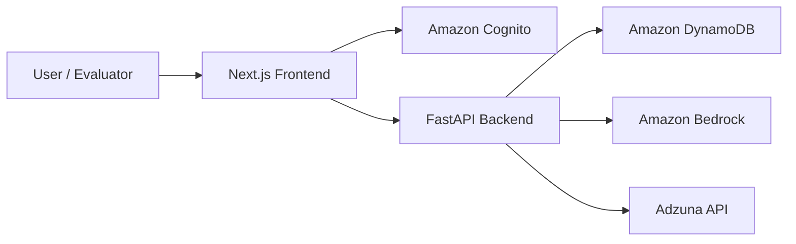

# CareerCat

**Author:** Zhiqi Zhang

**Website:** https://main.d2taej5h07fd9k.amplifyapp.com

CareerCat is an agentic AI job search assistant that helps users turn a messy, multi-step job search into a structured workspace. It supports resume-based profile setup, AI job post parsing, job recommendations, application tracking, interview and written assessment coaching, and an observability page for inspecting agent behavior.

The main pain point CareerCat addresses is that job seekers often have to manually copy jobs, track applications in spreadsheets, interpret resume-job fit, and prepare for interviews across disconnected tools. CareerCat brings those steps into one account-based web app where an LLM can decide which workflow or tool should handle the user's request.



## Features

- **Account-based workspaces:** Users can create their own CareerCat account with Amazon Cognito. Resume profiles, saved jobs, statuses, and preferences are stored per user.
- **Local development mode:** Developers can run the app locally with `AUTH_MODE=local` and browser-generated test users, without needing Cognito during early testing.
- **Resume/profile setup:** Users can upload a resume, let AI parse profile fields, manually correct extracted details, and save the edited version to their account.
- **Resume overwrite behavior:** Uploading a new resume for the same user re-parses the resume and updates the saved profile information.
- **Sponsorship preference:** Users can indicate whether they need visa sponsorship. The app uses this preference when importing and recommending jobs.
- **AI job post import:** Users can paste a job description. CareerCat parses it into structured fields such as title, company, location, salary, skills, requirements, dates, and sponsorship support.
- **Sponsorship warning during import:** If a user needs sponsorship and the pasted job appears not to support it, the app warns the user before saving.
- **Job recommendations:** CareerCat can search Adzuna jobs by role, keyword, location, posting date range, and other user needs, then filter recommendations against the user's sponsorship requirement.
- **Application dashboard:** Saved jobs are displayed in a board-like dashboard with filters, sorting, application status updates, application dates, posting dates, notes, and job details.
- **Application status tracking:** Jobs default to `Not Applied` and can be moved through statuses such as applied, assessment, interview, offer, rejected, or other progress states.
- **Agent Assist homepage:** The home page is an LLM-powered routing assistant. It can route the user to profile setup, job import, recommendations, dashboard, or coach workflows based on natural language input.
- **Smooth fallback behavior:** If the user enters unclear or unrelated text, Agent Assist provides platform guidance instead of forcing an irrelevant workflow.
- **AI Career Coach:** The coach supports resume-job gap analysis, technical mock interviews, behavioral mock interviews, and written assessment practice.
- **Language-aware code rendering:** Coach responses render fenced code blocks with syntax highlighting for common languages such as Python, SQL, JavaScript, TypeScript, JSON, Bash, HTML/XML, CSS, Java, C++, C#, R, Go, Rust, and YAML.
- **Developer observability page:** A gear icon opens a developer-facing page that shows agent runs, workflow decisions, errors, latency, success rates, tool usage, and quality checks.
- **Quality metric demo:** The observability page includes a Sponsorship Filter Accuracy Check where evaluators can choose a random sample size and visualize how sponsorship filtering performs.

## Set Up Instructions

This repository is a monorepo with a Next.js frontend and a FastAPI backend.

### Prerequisites and Dependencies

Install the following before running the project:

- **Git**
- **Node.js 20+** and npm
- **Python 3.11+**
- **AWS CLI** configured with credentials that can access the required AWS services
- **AWS services for full functionality:**
  - Amazon Bedrock model access
  - Amazon DynamoDB tables
  - Amazon Cognito User Pool for production-style authentication
  - AWS App Runner or another backend hosting option for deployment
  - AWS Amplify Hosting or another frontend hosting option for deployment
- **Adzuna API credentials** for live job recommendations
- **Docker** if deploying the backend through an image-based workflow

Important local-development note:

`AUTH_MODE=local` only bypasses Cognito authentication. It does not replace Bedrock, DynamoDB, or Adzuna. To test AI parsing, recommendations, saved profile data, saved jobs, and observability records locally, the backend still needs valid AWS credentials and DynamoDB tables.

### Installation

Clone the repository:

```bash
git clone https://github.com/zhiqi-zhang233/CareerCat.git
cd CareerCat
```

Install backend dependencies:

```bash
cd careercat-backend
python -m venv venv
source venv/bin/activate
pip install -r requirements.txt
cp .env.example .env
```

Install frontend dependencies:

```bash
cd ../careercat-frontend
npm install
cp .env.example .env.local
```

### Environment Variables

Never commit real `.env` or `.env.local` files. The repository includes example files that list the required variable names.

#### Backend: `careercat-backend/.env`

```env
AWS_REGION=us-east-2
BEDROCK_REGION=us-east-2
BEDROCK_MODEL_ID=anthropic.claude-3-haiku-20240307-v1:0

DYNAMODB_USER_PROFILES_TABLE=UserProfiles
DYNAMODB_JOB_POSTS_TABLE=JobPosts
DYNAMODB_AGENT_RUNS_TABLE=AgentRuns
DYNAMODB_COACH_SESSIONS_TABLE=CoachSessions

ADZUNA_APP_ID=your-adzuna-app-id
ADZUNA_APP_KEY=your-adzuna-app-key
ADZUNA_COUNTRY=us

# local or cognito
AUTH_MODE=local
COGNITO_REGION=us-east-2
COGNITO_USER_POOL_ID=your-cognito-user-pool-id
COGNITO_APP_CLIENT_ID=your-cognito-app-client-id

# Course/demo convenience only. Keep false unless intentionally enabling demo confirmation.
DEMO_AUTH_CONFIRM_ENABLED=false

CORS_ALLOWED_ORIGINS=http://localhost:3000,http://127.0.0.1:3000
```

#### Frontend: `careercat-frontend/.env.local`

```env
NEXT_PUBLIC_API_BASE_URL=http://127.0.0.1:8000

# local or cognito
NEXT_PUBLIC_AUTH_MODE=local
NEXT_PUBLIC_COGNITO_REGION=us-east-2
NEXT_PUBLIC_COGNITO_USER_POOL_ID=your-cognito-user-pool-id
NEXT_PUBLIC_COGNITO_APP_CLIENT_ID=your-cognito-app-client-id
```

#### Local Mode

Use local mode for fast local testing:

Backend:

```env
AUTH_MODE=local
```

Frontend:

```env
NEXT_PUBLIC_AUTH_MODE=local
NEXT_PUBLIC_API_BASE_URL=http://127.0.0.1:8000
```

In this mode, the frontend creates a local browser user id and sends it with requests. This is useful for development, but it is not suitable as the public account system.

#### Cognito Mode

Use Cognito mode for the deployed app:

Backend:

```env
AUTH_MODE=cognito
COGNITO_REGION=us-east-2
COGNITO_USER_POOL_ID=your-cognito-user-pool-id
COGNITO_APP_CLIENT_ID=your-cognito-app-client-id
```

Frontend:

```env
NEXT_PUBLIC_AUTH_MODE=cognito
NEXT_PUBLIC_COGNITO_REGION=us-east-2
NEXT_PUBLIC_COGNITO_USER_POOL_ID=your-cognito-user-pool-id
NEXT_PUBLIC_COGNITO_APP_CLIENT_ID=your-cognito-app-client-id
```

In Cognito mode, the frontend sends a Cognito ID token with API requests. The backend verifies the token and uses the Cognito user `sub` as the user's internal `user_id`.

### Running Locally

Start the backend:

```bash
cd careercat-backend
source venv/bin/activate
uvicorn app.main:app --reload --host 127.0.0.1 --port 8000
```

Check the backend health endpoint:

```bash
curl http://127.0.0.1:8000/health
```

Start the frontend in another terminal:

```bash
cd careercat-frontend
npm run dev
```

Open the app:

```text
http://localhost:3000
```

### DynamoDB Tables

CareerCat expects four DynamoDB tables:

```text
UserProfiles
JobPosts
AgentRuns
CoachSessions
```

The code reads the exact names from environment variables, so the table names can be changed as long as the environment variables are updated. The current implementation stores user profile records, saved job records, agent observability records, and cross-device coach chat history in DynamoDB.

### Useful Developer Commands

Frontend:

```bash
cd careercat-frontend
npm run lint
npm run build
```

Backend:

```bash
cd careercat-backend
source venv/bin/activate
uvicorn app.main:app --reload
```

Docker backend image build:

```bash
cd careercat-backend
docker build -t careercat-backend .
```

## Usage

CareerCat is primarily used through the web interface.

### 1. Start With Agent Assist

Open the home page. The Agent Assist panel asks what the user wants to do next. Starter requests fill the text box first so the user can edit details before asking the agent.

Example requests:

```text
I want to create a new profile and upload my resume.
```

```text
I want to import a job description and save the structured job information.
```

```text
Recommend jobs for me based on specific requirements like role, location, salary, and posting date.
```

```text
I want to review my current application status and saved jobs.
```

```text
Train me for a written assessment on statistics.
```

The LLM supervisor decides whether to route the user to profile setup, job import, job recommendations, the dashboard, or the coach page. If the message is vague or unrelated, it gives guidance instead of forcing a route.

### 2. Build a Profile

Go to **Profile Setup** and upload a resume. CareerCat parses the resume into editable profile fields. Users can correct parsed information and save those edits to their account. If the same user uploads a new resume later, the new parsed result updates the profile.

Users can also set whether they need visa sponsorship. That preference affects job import warnings and recommendation filtering.

### 3. Import a Job Description

Go to **Import Jobs** and paste a job post. CareerCat uses AI to extract structured job information, including title, company, location, skills, requirements, compensation, dates, and sponsorship signal.

If the user needs sponsorship and the job appears not to support sponsorship, CareerCat warns the user and asks whether they still want to save it.

### 4. Get Job Recommendations

Go to **Job Recommendations** or ask Agent Assist for fresh jobs. CareerCat uses Adzuna as a job source and can search by keyword, role, location, posting window, and result count. The recommendation workflow avoids recommending jobs that conflict with the user's sponsorship requirement when sponsorship information is detectable.

### 5. Track Applications

Go to **Dashboard** to view saved jobs. Users can filter and sort by fields such as job title, location, salary, posting date, application date, skills, and application status. Saved jobs default to `Not Applied`, and users can update each job as they move through the application process.

### 6. Practice With AI Career Coach

Go to **Coach** to start a coaching session. CareerCat supports three coaching modes:

- **Resume and Job Gap:** Select a saved job from the dashboard. The coach explains how the user's resume could be improved for that role and what skills are missing.
- **Mock Interview:** Choose technical or behavioral interview practice. The coach asks one question at a time, scores the answer, and continues when the user is ready.
- **Written Assessment:** Enter a topic such as statistics, SQL, Python, algorithms, or data analysis. The coach explains concepts, gives practice problems, and can show code with language-aware syntax highlighting.

### 7. Inspect Observability and Metrics

Open the gear icon in the header to view the developer observability page. This page is designed to be readable for evaluators, not just engineers. It shows recent agent runs, workflow decisions, selected tools, status, latency, inputs, outputs, errors, and summary metrics.

The page also includes a quality metric demo: **Sponsorship Filter Accuracy Check**. An evaluator can choose a random sample size, run the check, and see how accurately the sponsorship filter handles labeled examples.

### Example API Check

Backend health check:

```bash
curl http://127.0.0.1:8000/health
```

Expected response:

```json
{
  "status": "ok"
}
```

## Tech Stack

### Languages

- TypeScript
- Python
- CSS
- JSON
- Shell scripts / CLI commands

### Frameworks and Libraries

- Next.js 16
- React 19
- Tailwind CSS 4
- FastAPI
- Pydantic
- Uvicorn
- Boto3
- PyJWT
- Amazon Cognito Identity JS
- highlight.js for coach code block rendering

### Tools, Services, and APIs

- Amazon Bedrock for LLM-powered parsing, routing, recommendations, and coaching
- Amazon DynamoDB for user data and observability records
- Amazon Cognito for production account authentication
- AWS App Runner for backend deployment
- AWS Amplify Hosting for frontend deployment
- Amazon ECR for backend container images when using image deployment
- Adzuna API for job search data
- Docker for backend containerization
- GitHub for source control and Amplify deployment integration

## Project Structure

```text
CareerCat/
+-- README.md
+-- careercat-backend/
|   +-- Dockerfile
|   +-- apprunner.yaml
|   +-- requirements.txt
|   +-- .env.example
|   +-- app/
|       +-- main.py
|       +-- config.py
|       +-- auth.py
|       +-- routers/
|       |   +-- agent.py
|       |   +-- analysis.py
|       |   +-- auth.py
|       |   +-- coach.py
|       |   +-- debug.py
|       |   +-- job_discovery.py
|       |   +-- jobs.py
|       |   +-- observability.py
|       |   +-- profile.py
|       |   +-- recommend.py
|       +-- schemas/
|       |   +-- agent.py
|       |   +-- coach.py
|       |   +-- job_discovery.py
|       |   +-- jobs.py
|       |   +-- observability.py
|       |   +-- profile.py
|       +-- services/
|           +-- adzuna_service.py
|           +-- agent_assist_service.py
|           +-- bedrock_service.py
|           +-- dynamodb_service.py
|           +-- fit_analysis_service.py
|           +-- interview_coach_service.py
|           +-- job_discovery_service.py
|           +-- job_parser_service.py
|           +-- observability_service.py
|           +-- recommend_service.py
|           +-- resume_file_service.py
|           +-- resume_parser_service.py
|           +-- sponsorship_filter_service.py
+-- careercat-frontend/
    +-- amplify.yml
    +-- package.json
    +-- package-lock.json
    +-- tsconfig.json
    +-- .env.example
    +-- app/
    |   +-- page.tsx
    |   +-- layout.tsx
    |   +-- globals.css
    |   +-- profile/page.tsx
    |   +-- import-jobs/page.tsx
    |   +-- recommendations/page.tsx
    |   +-- dashboard/page.tsx
    |   +-- coach/page.tsx
    |   +-- observability/page.tsx
    +-- components/
    |   +-- AuthGate.tsx
    |   +-- Header.tsx
    +-- lib/
    |   +-- api.ts
    |   +-- AuthContext.tsx
    |   +-- authConfig.ts
    |   +-- authToken.ts
    |   +-- session.ts
    |   +-- types.ts
    |   +-- useLocalUserId.ts
    +-- public/
        +-- logo.svg
```

### Important Backend Areas

- `app/main.py`: FastAPI app setup, CORS, and router registration.
- `app/auth.py`: Local mode and Cognito token verification.
- `app/routers/`: API route definitions by feature area.
- `app/schemas/`: Pydantic request and response models.
- `app/services/bedrock_service.py`: Bedrock LLM calls and structured parsing helpers.
- `app/services/agent_assist_service.py`: Agent Assist routing and tool-selection logic.
- `app/services/dynamodb_service.py`: DynamoDB persistence for profiles, jobs, and observability records.
- `app/services/sponsorship_filter_service.py`: Sponsorship filtering and quality-check samples.

### Important Frontend Areas

- `app/page.tsx`: Agent Assist homepage.
- `app/profile/page.tsx`: Resume upload and editable profile setup.
- `app/import-jobs/page.tsx`: Job description import and sponsorship warning workflow.
- `app/recommendations/page.tsx`: Adzuna-backed job discovery UI.
- `app/dashboard/page.tsx`: Saved job board with status tracking, filtering, and sorting.
- `app/coach/page.tsx`: AI Career Coach sessions and code-aware Markdown rendering.
- `app/observability/page.tsx`: Developer/evaluator observability and metrics page.
- `components/AuthGate.tsx`: Switches between local auth and Cognito auth.
- `lib/api.ts`: Frontend API client.

## Deployment Notes

The deployed course version uses AWS:

- **Frontend:** AWS Amplify Hosting
- **Backend:** AWS App Runner
- **Authentication:** Amazon Cognito
- **Database:** Amazon DynamoDB
- **LLM:** Amazon Bedrock
- **Job data:** Adzuna API
- **Container registry:** Amazon ECR, if using image-based backend deployment

### Current Public Frontend URL

```text
https://main.d2taej5h07fd9k.amplifyapp.com/
```

### Current Backend URL

```text
https://rpgqpmg46v.us-east-2.awsapprunner.com
```

These URLs may change if the AWS services are recreated.

### Frontend Deployment With AWS Amplify

The frontend is deployed from the `careercat-frontend` monorepo root. The repository includes:

```text
careercat-frontend/amplify.yml
```

Amplify build settings:

```yaml
version: 1
frontend:
  phases:
    preBuild:
      commands:
        - npm ci
    build:
      commands:
        - npm run build
  artifacts:
    baseDirectory: .next
    files:
      - '**/*'
  cache:
    paths:
      - node_modules/**/*
```

Required Amplify environment variables:

```env
NEXT_PUBLIC_API_BASE_URL=https://your-backend-url
NEXT_PUBLIC_AUTH_MODE=cognito
NEXT_PUBLIC_COGNITO_REGION=us-east-2
NEXT_PUBLIC_COGNITO_USER_POOL_ID=your-cognito-user-pool-id
NEXT_PUBLIC_COGNITO_APP_CLIENT_ID=your-cognito-app-client-id
```

### Backend Deployment With AWS App Runner

The backend can be deployed with App Runner using `careercat-backend/Dockerfile` or `careercat-backend/apprunner.yaml`.

Required App Runner environment variables:

```env
AWS_REGION=us-east-2
BEDROCK_REGION=us-east-2
BEDROCK_MODEL_ID=your-bedrock-model-id
DYNAMODB_USER_PROFILES_TABLE=UserProfiles
DYNAMODB_JOB_POSTS_TABLE=JobPosts
DYNAMODB_AGENT_RUNS_TABLE=AgentRuns
DYNAMODB_COACH_SESSIONS_TABLE=CoachSessions
ADZUNA_APP_ID=your-adzuna-app-id
ADZUNA_APP_KEY=your-adzuna-app-key
ADZUNA_COUNTRY=us
AUTH_MODE=cognito
COGNITO_REGION=us-east-2
COGNITO_USER_POOL_ID=your-cognito-user-pool-id
COGNITO_APP_CLIENT_ID=your-cognito-app-client-id
DEMO_AUTH_CONFIRM_ENABLED=false
CORS_ALLOWED_ORIGINS=https://your-amplify-url,http://localhost:3000
```

### AWS Permissions Needed by the Backend

The backend runtime role needs permission to:

- Read and write the configured DynamoDB tables.
- Call the selected Amazon Bedrock model.
- Read required AWS region/account metadata.

If deploying from ECR, App Runner also needs an access role that can pull the backend image from ECR.

### Cognito Notes

For production-style deployment:

1. Create a Cognito User Pool.
2. Create an App Client without a client secret for browser-based login.
3. Put the User Pool ID and App Client ID into both frontend and backend environment variables.
4. Set `AUTH_MODE=cognito` in the backend.
5. Set `NEXT_PUBLIC_AUTH_MODE=cognito` in the frontend.

For a course demo, `DEMO_AUTH_CONFIRM_ENABLED` can be temporarily set to `true` to expose a demo confirmation endpoint/button if email confirmation is unreliable. This is a convenience for evaluation only and should not be used for a real production product.

### Observability and Metrics

CareerCat records workflow traces in the `AgentRuns` DynamoDB table. Coach conversations are stored separately in the `CoachSessions` table so history follows the user's account across browsers and devices. The observability page summarizes:

- Recent agent/tool runs.
- Workflow names and selected tools.
- Success and failure states.
- Latency in milliseconds.
- Inputs and outputs/results.
- Errors for debugging.
- Workflow usage counts.
- Sponsorship Filter Accuracy Check as a quality metric.

These records help evaluators see that the LLM is not only generating text, but making workflow decisions, choosing tools, and producing inspectable system behavior.

### Why This System Is Agentic

CareerCat includes deterministic UI workflows, but its key agentic component is the Agent Assist supervisor. Given a user's natural-language request, the LLM decides whether to:

- Route to profile setup.
- Trigger job recommendation workflow.
- Route to job post import.
- Open the application dashboard.
- Start resume-job gap analysis.
- Start a mock interview.
- Start written assessment training.
- Ask a follow-up question.
- Stay on the home page and provide guidance for unclear input.

The same input box can lead to different tools, pages, arguments, and next steps. That dynamic routing and tool selection is what makes the system meaningfully agentic rather than a fixed pipeline.

### Reproducing or Extending the Project

To reproduce the project:

1. Fork or clone the repository.
2. Create the required AWS resources: DynamoDB tables, Bedrock model access, Cognito User Pool, and optional App Runner/Amplify services.
3. Create Adzuna API credentials.
4. Fill in backend and frontend environment variables.
5. Run the backend and frontend locally first.
6. Deploy the backend and confirm `/health` works.
7. Deploy the frontend and set `NEXT_PUBLIC_API_BASE_URL` to the backend URL.
8. Confirm CORS allows the deployed frontend URL.
9. Create a test account or use local mode for development.
10. Test the main workflows: profile setup, job import, recommendations, dashboard status updates, coach sessions, and observability.

Common extension points:

- Add more job data providers in `careercat-backend/app/services/`.
- Add more coach modes in `interview_coach_service.py` and `app/coach/page.tsx`.
- Add new observability metrics in `observability_service.py` and `app/observability/page.tsx`.
- Add more structured job fields in `schemas/jobs.py`, `job_parser_service.py`, and the dashboard UI.
