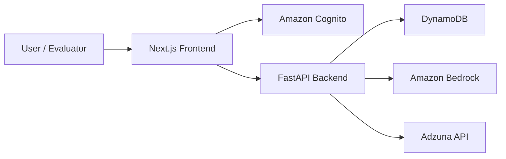

# CareerCat

CareerCat is an agentic AI job-search assistant that helps users manage a personalized job search workflow. It supports resume profile setup, job post parsing, job recommendations, application tracking, interview coaching, and developer-facing observability.

## Features

- Account-based user workspaces with Amazon Cognito email/password authentication.
- Local development mode with browser-based local accounts.
- Resume parsing into structured profile fields.
- Job post import with AI parsing and sponsorship warnings.
- Adzuna-powered job discovery and recommendations.
- Dashboard for saved jobs, filters, sorting, application status, dates, and notes.
- AI Career Coach for resume-job gap analysis, mock interviews, and written assessment practice.
- Observability dashboard for agent/tool runs, latency, errors, workflow counts, and quality checks.
- Sponsorship Filter Accuracy Check with random labeled test samples.

## Architecture



## Repository Structure

```text
careercat-frontend/
  Next.js app, UI pages, Cognito client auth, API client

careercat-backend/
  FastAPI app, Bedrock services, DynamoDB services, Cognito JWT verification
```

## Local Development

### Backend

```bash
cd careercat-backend
python -m venv venv
source venv/bin/activate
pip install -r requirements.txt
cp .env.example .env
uvicorn app.main:app --reload
```

For local development, keep:

```env
AUTH_MODE=local
```

### Frontend

```bash
cd careercat-frontend
npm install
cp .env.example .env.local
npm run dev
```

For local development, keep:

```env
NEXT_PUBLIC_AUTH_MODE=local
NEXT_PUBLIC_API_BASE_URL=http://127.0.0.1:8000
```

Then open:

```text
http://localhost:3000
```

## Production Authentication

Production mode uses Amazon Cognito. Set these variables in the backend:

```env
AUTH_MODE=cognito
COGNITO_REGION=us-east-2
COGNITO_USER_POOL_ID=your-user-pool-id
COGNITO_APP_CLIENT_ID=your-app-client-id
```

Set these variables in the frontend:

```env
NEXT_PUBLIC_AUTH_MODE=cognito
NEXT_PUBLIC_COGNITO_REGION=us-east-2
NEXT_PUBLIC_COGNITO_USER_POOL_ID=your-user-pool-id
NEXT_PUBLIC_COGNITO_APP_CLIENT_ID=your-app-client-id
```

In Cognito mode, the frontend sends a Cognito ID token with each API request. The backend verifies the token and uses the Cognito `sub` as the user's `user_id`.

## Required Environment Variables

### Backend

```env
AWS_REGION=us-east-2
DYNAMODB_USER_PROFILES_TABLE=UserProfiles
DYNAMODB_JOB_POSTS_TABLE=JobPosts
DYNAMODB_AGENT_RUNS_TABLE=AgentRuns
BEDROCK_REGION=us-east-2
BEDROCK_MODEL_ID=your-bedrock-model-id
ADZUNA_APP_ID=your-adzuna-app-id
ADZUNA_APP_KEY=your-adzuna-app-key
ADZUNA_COUNTRY=us
AUTH_MODE=local-or-cognito
COGNITO_REGION=us-east-2
COGNITO_USER_POOL_ID=your-cognito-user-pool-id
COGNITO_APP_CLIENT_ID=your-cognito-app-client-id
CORS_ALLOWED_ORIGINS=http://localhost:3000,https://your-frontend-url
```

### Frontend

```env
NEXT_PUBLIC_API_BASE_URL=http://127.0.0.1:8000
NEXT_PUBLIC_AUTH_MODE=local-or-cognito
NEXT_PUBLIC_COGNITO_REGION=us-east-2
NEXT_PUBLIC_COGNITO_USER_POOL_ID=your-cognito-user-pool-id
NEXT_PUBLIC_COGNITO_APP_CLIENT_ID=your-cognito-app-client-id
```

Do not commit `.env` or `.env.local` files.

## AWS Deployment Notes

Recommended deployment:

- Frontend: AWS Amplify Hosting
- Backend: AWS App Runner
- Auth: Amazon Cognito User Pool
- Data: DynamoDB
- LLM: Amazon Bedrock

Backend deployment files are included in `careercat-backend/`:

- `Dockerfile`
- `apprunner.yaml`

Frontend deployment config is included in `careercat-frontend/amplify.yml`.

For an Amplify monorepo deployment, set the app root to:

```text
careercat-frontend
```

For App Runner, set the backend source directory to:

```text
careercat-backend
```

## Observability and Metrics

CareerCat records agent and tool workflow events in DynamoDB. The Developer Observability page shows:

- Recorded agent runs
- Workflow success rate
- Average latency
- Failure count
- Workflow/tool breakdowns
- Recent run logs with inputs, decisions, results, and errors
- Sponsorship Filter Accuracy Check with random sample sizes

## Agentic Behavior

CareerCat includes an Agent Assist supervisor on the home page. The LLM decides whether to:

- Route the user to profile setup
- Search for job recommendations
- Parse a pasted job post
- Open the dashboard
- Start gap analysis
- Start mock interview practice
- Start written assessment practice
- Stay on the home page and provide platform guidance when the user input is unclear

This means the LLM controls routing and tool selection instead of always following a fixed deterministic workflow.

## External Services

- Amazon Bedrock for LLM-powered parsing, routing, and coaching.
- Amazon Cognito for user accounts.
- Amazon DynamoDB for user data and observability records.
- Adzuna API for job discovery.

