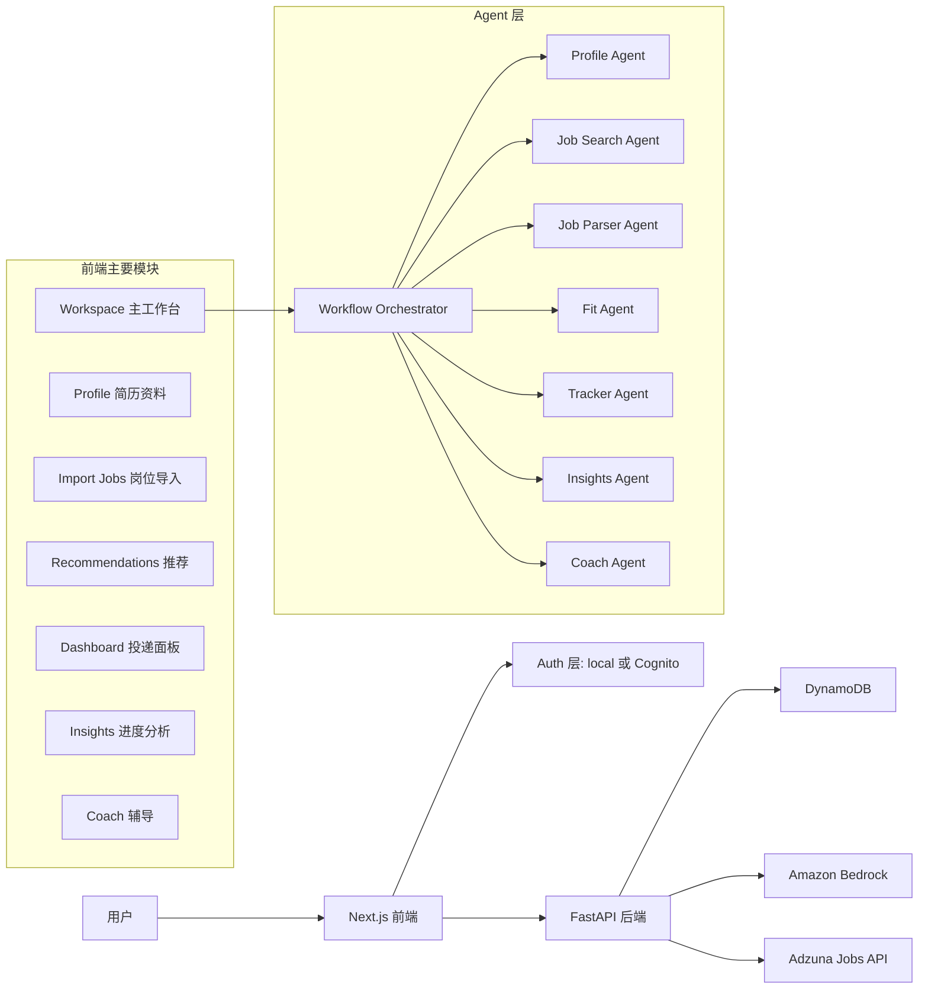
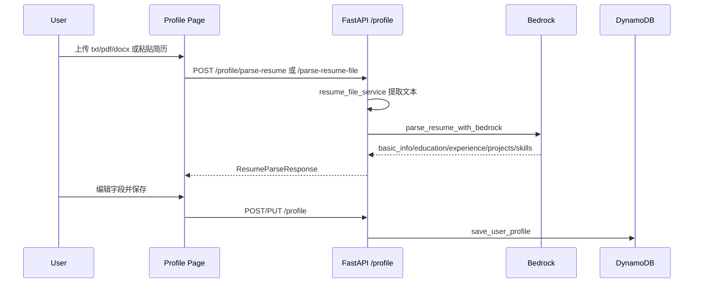
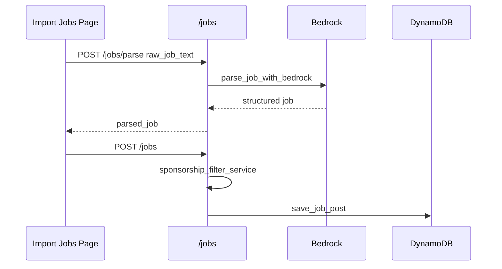
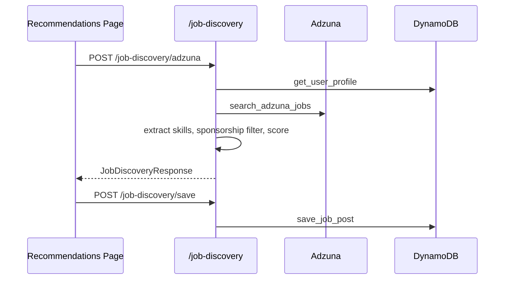
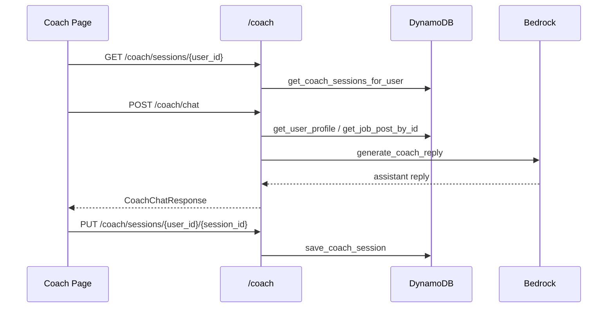
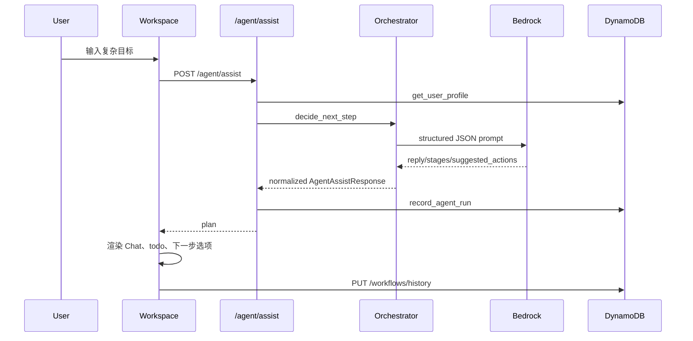

# CareerCat 平台架构与工程实现说明

> 面向接手项目的工程师或前端/产品/全栈 AI。目标是让对方拿到本文后，能快速理解 CareerCat 当前平台能力、代码组织、核心数据流、Agent 架构、AWS 集成和后续扩展方式。

更新日期：2026-05-10

## 1. 产品定位

CareerCat 是一个面向求职者的 agentic AI 求职工作台。它试图把零散的求职流程整合到同一个账户体系下，让用户可以从一个复杂目标出发，例如“帮我找芝加哥 H1B 数据分析岗位，保存到投递面板，并准备 SQL 面试”，由主 Agent 拆解任务，再交给不同功能页和专项 Subagent 执行。

当前核心能力包括：

- 简历上传、解析、编辑和保存
- 用户 Profile、目标岗位、地点、签证担保偏好管理
- 岗位描述粘贴导入和 AI 结构化解析
- Adzuna 岗位搜索、推荐、匹配度评分和保存
- 投递面板和 Kanban 进度管理
- 求职进度 Insights 分析
- Coach 页面支持 gap analysis、模拟面试和笔试/SQL/技术练习
- Workspace 页面提供类似 ChatGPT 的主 Agent 对话、平台任务 todo、下一步可交互选项和云端历史工作流
- 中英双语 UI 和 Agent 输出

## 2. 高层架构



## 3. Monorepo 结构

项目根目录：

```text
CareerCat/
  README.md
  docs/
    careercat-ui-upgrade-prd.md
    careercat-architecture-and-implementation.md
  careercat-frontend/
  careercat-backend/
```

前端：

```text
careercat-frontend/
  app/
    (marketing)/
      page.tsx              # 首页 landing page
      pricing/page.tsx
    (app)/
      layout.tsx            # 登录后 AppShell 布局
      workspace/page.tsx    # 主 Agent 工作台
      profile/page.tsx      # 简历/Profile
      import-jobs/page.tsx  # 岗位导入
      recommendations/page.tsx
      dashboard/page.tsx
      insights/page.tsx
      coach/page.tsx
      settings/page.tsx
    globals.css             # 全局设计 token、背景、通用组件类
    layout.tsx              # 根布局
  components/
    AppShell.tsx            # 登录后顶部栏、侧边导航/hover 菜单
    AuthGate.tsx
    Header.tsx
    LocaleSwitcher.tsx
    MarketingHeader.tsx
    MarketingFooter.tsx
    PaintingCanvas.tsx
    kanban/
  lib/
    api.ts                  # 前端 API client
    types.ts                # 前后端共享 TS 类型
    AuthContext.tsx
    authConfig.ts
    authToken.ts
    session.ts
    useLocalUserId.ts
    i18n/
      LocaleProvider.tsx
      dictionaries.ts
```

后端：

```text
careercat-backend/
  app/
    main.py                 # FastAPI app 和 router 注册
    config.py               # env、AWS、Bedrock、DynamoDB、Cognito 配置
    auth.py                 # local/Cognito 鉴权与 user_id 解析
    routers/
      agent.py              # /agent/assist 主工作台 Agent
      profile.py            # /profile 简历/Profile
      jobs.py               # /jobs 岗位解析、保存、CRUD
      job_discovery.py      # /job-discovery Adzuna 搜索与保存
      recommend.py          # /recommend 旧推荐接口
      analysis.py           # /analysis/fit
      coach.py              # /coach 教练与会话
      workflows.py          # /workflows/history 工作流历史
    schemas/
      agent.py
      profile.py
      jobs.py
      job_discovery.py
      coach.py
      workflows.py
    services/
      bedrock_service.py
      workflow_agent_registry.py
      agent_assist_service.py
      dynamodb_service.py
      resume_file_service.py
      resume_parser_service.py
      job_parser_service.py
      job_discovery_service.py
      sponsorship_filter_service.py
      fit_analysis_service.py
      interview_coach_service.py
      observability_service.py
      adzuna_service.py
```

## 4. 前端实现

### 4.1 技术栈

- Next.js 16 App Router
- React 19
- TypeScript
- Tailwind CSS 4 via global CSS utilities
- Amazon Cognito JS SDK
- highlight.js 用于 Coach 代码块渲染

核心入口：

- API 调用统一在 `careercat-frontend/lib/api.ts`
- 类型定义在 `careercat-frontend/lib/types.ts`
- 语言包在 `careercat-frontend/lib/i18n/dictionaries.ts`
- 当前用户 ID 在 `useLocalUserId()` 和 AuthContext 中处理

### 4.2 页面能力

| Route | 文件 | 功能 |
| --- | --- | --- |
| `/` | `app/(marketing)/page.tsx` | 营销首页。包含 hero、功能介绍、How it works、pricing preview、CTA |
| `/workspace` | `app/(app)/workspace/page.tsx` | 主 Agent 工作台。Chat UI、todo、简历上传组件、下一步选项、历史工作流 |
| `/profile` | `app/(app)/profile/page.tsx` | 上传 `.txt/.pdf/.docx` 简历，AI 解析，编辑 Profile 字段并保存 |
| `/import-jobs` | `app/(app)/import-jobs/page.tsx` | 粘贴 JD，AI 解析岗位字段，保存到 dashboard |
| `/recommendations` | `app/(app)/recommendations/page.tsx` | Adzuna 搜索岗位，展示匹配度，保存推荐岗位 |
| `/dashboard` | `app/(app)/dashboard/page.tsx` | 已保存岗位列表/看板，筛选、排序、编辑、状态更新、删除 |
| `/insights` | `app/(app)/insights/page.tsx` | 基于已保存岗位在前端计算 KPI、漏斗、技能、公司、节奏 |
| `/coach` | `app/(app)/coach/page.tsx` | Gap analysis、mock interview、written practice，会话历史和代码块渲染 |
| `/settings` | `app/(app)/settings/page.tsx` | 账户模式、登出、本地账号切换 |

### 4.3 AppShell 和导航

`components/AppShell.tsx` 负责登录后页面的统一顶部栏和导航。当前设计是顶部栏保持一致，左侧 icon/书包区域 hover 时可以展开功能导航，鼠标移出导航触发收回。CareerCat logo 可以从工作台跳回首页。

导航目标大致对应：

- Workspace
- Profile
- Recommendations
- Import Jobs
- Dashboard
- Insights
- Coach
- Settings

### 4.4 i18n

当前 UI 通过 `LocaleProvider` 提供 `locale` 和 `t()`。字典文件为：

```text
careercat-frontend/lib/i18n/dictionaries.ts
```

Agent 请求会把当前 locale 传给后端 `/agent/assist` 和 `/coach/chat`，后端 prompt 会要求模型用对应语言输出。字段名、route、tool 名称保持英文。

### 4.5 Workspace 前端逻辑

`app/(app)/workspace/page.tsx` 是目前最复杂的页面，主要状态包括：

- `messages`: 当前 workflow 的聊天消息
- `plan`: 后端 Agent 返回的 `AgentAssistResponse`
- `workflowId`: 当前工作流 ID
- `workflowHistory`: 从 DynamoDB 读取的历史工作流列表
- `completedTaskIds`: 已完成 todo ID 集合
- `profileAvailable`: 是否已有简历/Profile 上下文

核心行为：

1. 用户输入目标，前端调用 `sendAgentAssist()`
2. 后端返回 reply、stages、suggested_actions
3. 前端把 user/assistant message 放到 Chat UI
4. 右侧 `TaskPanel` 只显示平台可执行任务，不显示内部 harness 细节
5. 如果任务需要 Profile 且用户没有简历，前端插入简历上传组件
6. 简历上传成功后，Profile todo 打勾、划掉、变暗，但不会消失
7. Chat 内出现下一步选项，例如查看 Profile、导入岗位、推荐岗位、进入 Coach
8. 工作流历史保存到后端 `/workflows/history`

注意：聊天历史已经转为 DynamoDB 保存。页面之间传递“上一次 Agent plan”的 `careercat_last_agent_decision` 仍使用浏览器 localStorage，主要用于 Recommendations/Coach 等页面读取当前 handoff 参数。这不是聊天历史。如果要做到完全无 localStorage，需要改成服务端 session 或 workflow_id URL 参数。

## 5. 后端实现

### 5.1 技术栈

- FastAPI
- Pydantic v2
- boto3
- Amazon Bedrock Runtime
- Amazon DynamoDB
- Amazon Cognito JWT 校验
- Adzuna API
- pypdf、python-docx 用于简历文件文本提取

### 5.2 FastAPI 入口

`app/main.py` 注册所有 router：

```text
/profile
/recommend
/jobs
/analysis
/coach
/job-discovery
/agent
/workflows
```

健康检查：

```text
GET /health
```

### 5.3 配置

`app/config.py` 从 `.env` 读取：

- AWS region
- DynamoDB table names
- Bedrock region 和默认模型
- 每类 workflow agent 可选模型
- Adzuna credentials
- Auth mode
- Cognito 配置
- CORS origins

当前已支持按 agent 配置模型：

```text
BEDROCK_MODEL_ID
WORKFLOW_ORCHESTRATOR_MODEL_ID
WORKFLOW_PROFILE_AGENT_MODEL_ID
WORKFLOW_JOB_SEARCH_AGENT_MODEL_ID
WORKFLOW_JOB_PARSER_AGENT_MODEL_ID
WORKFLOW_FIT_AGENT_MODEL_ID
WORKFLOW_TRACKER_AGENT_MODEL_ID
WORKFLOW_INSIGHTS_AGENT_MODEL_ID
WORKFLOW_COACH_AGENT_MODEL_ID
```

未设置专项模型时会 fallback 到 `BEDROCK_MODEL_ID`。

### 5.4 鉴权

`app/auth.py` 支持两种模式：

- `AUTH_MODE=local`: 本地开发，后端信任请求体中的 `user_id`
- `AUTH_MODE=cognito`: 后端校验 Cognito ID token，使用 token claims 中的 `sub` 作为真实 user_id

后端每个用户相关接口通常会调用：

```python
resolve_user_id(payload.user_id, auth_user_id)
```

防止 Cognito 模式下访问其他用户数据。

## 6. DynamoDB 数据层

集中在：

```text
careercat-backend/app/services/dynamodb_service.py
```

当前表：

| Table | 主键设计 | 用途 |
| --- | --- | --- |
| `UserProfiles` | `user_id` | 用户 Profile、简历、技能、目标岗位、地点、担保需求 |
| `JobPosts` | `user_id` + `job_id` | 导入/保存的岗位，状态、日期、notes、结构化字段 |
| `AgentRuns` | 通常 `user_id` + run id/time | Agent/tool 运行日志、延迟、错误、调试信息 |
| `CoachSessions` | `user_id` + `session_id` | Coach 跨设备会话历史 |
| `WorkflowHistories` | `user_id` + `workflow_id` | Workspace 聊天历史、plan、completed_task_ids |

主要函数：

- `save_user_profile`, `get_user_profile`, `update_user_profile`
- `save_job_post`, `get_job_posts_for_user`, `update_job_post`, `delete_job_post`
- `save_agent_run`, `get_agent_runs_for_user`
- `save_coach_session`, `get_coach_sessions_for_user`, `delete_coach_session`
- `save_workflow_history`, `get_workflow_histories_for_user`, `delete_workflow_history`

## 7. Bedrock 和 AI 服务层

### 7.1 Bedrock 基础调用

`services/bedrock_service.py` 封装 Bedrock Runtime `converse()`：

- `generate_structured_json()`: 用于要求模型返回 JSON
- `generate_text()`: 用于普通文本回复
- `parse_resume_with_bedrock()`: 简历解析 prompt
- `parse_job_with_bedrock()`: 岗位解析 prompt
- `generate_bedrock_interview_prep()`: 面试准备 JSON

这两个底层方法已支持 `model_id` 参数，所以不同 agent 后续可以切不同模型。

### 7.2 Workflow 主 Agent 和 Subagent

当前最重要的 Agent 文件：

```text
services/workflow_agent_registry.py
services/agent_assist_service.py
routers/agent.py
schemas/agent.py
```

#### Orchestrator

`agent_assist_service.decide_next_step()` 是 Workspace 主 Agent 入口。它会：

1. 根据 locale 生成语言指令
2. 从 `workflow_agent_registry.build_workflow_orchestrator_prompt()` 获取主 prompt
3. 注入用户 Profile 摘要
4. 调用 Bedrock 生成结构化 JSON
5. normalize 输出，确保 route/tool/status 合法
6. 失败时走本地 fallback planner

#### Subagent registry

`workflow_agent_registry.py` 定义每个 Subagent 的：

- `agent_id`
- `display_name`
- `stage_agent`
- `route`
- `tool`
- `intents`
- `prompt`

当前 Subagent：

| Subagent | route | tool | 职责 |
| --- | --- | --- | --- |
| Profile Agent | `/profile` | `go_to_profile` | 简历/Profile 上下文、技能、目标、地点、担保需求 |
| Job Search Agent | `/recommendations` | `search_adzuna_jobs` | 搜索参数、Adzuna 岗位发现、推荐入口 |
| Job Parser Agent | `/import-jobs` | `parse_job_post` | 粘贴 JD 的结构化解析 |
| Fit Agent | `/coach` | `start_gap_analysis` | 简历和岗位 gap、匹配度、优先级 |
| Tracker Agent | `/dashboard` | `view_dashboard` | 保存岗位、投递状态、notes、下一步 |
| Insights Agent | `/insights` | `view_insights` | 漏斗、回复率、瓶颈、复盘 |
| Coach Agent | `/coach` | `start_mock_interview` | 面试、笔试、SQL/Python/analytics 练习 |

#### Agent 输出 Schema

`AgentAssistResponse` 返回：

```ts
{
  reply: string;
  intent: string;
  selected_tool: string;
  route: string;
  reason: string;
  needs_user_input: boolean;
  follow_up_question?: string | null;
  tool_args: Record<string, unknown>;
  workflow_goal: string;
  current_stage_id: string;
  stages: WorkflowStage[];
  suggested_actions?: WorkflowSuggestedAction[];
  harness?: {...};
}
```

`stages` 是平台 todo 的来源。前端会再过滤内部任务，只显示真正需要用户使用页面/组件完成的任务。

`suggested_actions` 是 Chat 内下一步选项的来源。它必须映射到真实 route。

#### 防幻觉策略

当前 prompt 和 normalize 逻辑强调：

- 不编造简历/Profile、保存岗位、公司、岗位要求、薪资、投递状态
- gap analysis 需要候选人上下文和岗位上下文
- 缺少简历时创建 `/profile` 任务
- 缺少岗位/JD 时创建 `/import-jobs` 或 `/recommendations` 任务
- Coach 建议和事实性结论分开

如果 Bedrock 失败，本地 fallback 通过关键词检测生成保守 plan。

## 8. 主要功能数据流

### 8.1 简历/Profile



核心文件：

- `frontend/app/(app)/profile/page.tsx`
- `backend/routers/profile.py`
- `backend/services/resume_file_service.py`
- `backend/services/bedrock_service.py`
- `backend/services/dynamodb_service.py`

### 8.2 岗位导入



如果用户 Profile 中 `sponsorship_need=true`，且岗位文本推断 `visa_sponsorship=No`，后端会返回 warning，前端要求用户确认是否仍保存。

### 8.3 岗位推荐



推荐评分主要在 `job_discovery_service.py`，目前是规则评分：

- 用户技能和岗位技能交集
- target_roles 是否匹配 title
- 搜索关键词是否匹配 title/description
- preferred_locations 是否匹配
- sponsorship filter

### 8.4 Dashboard 和 Insights

Dashboard：

- 从 `GET /jobs/{user_id}` 读取保存岗位
- 支持 list 和 kanban 视图
- 支持 status、location、skill、salary、search、sort
- 用 `PATCH /jobs/{user_id}/{job_id}` 保存编辑和状态
- 用 `DELETE /jobs/{user_id}/{job_id}` 删除

Insights：

- 目前主要在前端基于保存岗位计算
- 包括总岗位、活跃申请、回复率、平均响应天数、周节奏、技能分布、公司分布、建议

### 8.5 Coach

Coach 支持三种模式：

- `gap_analysis`
- `mock_interview`
- `written_practice`

数据流：



`interview_coach_service.py` 的 prompt 要求：

- 不编造 Profile 事实
- gap analysis 要对比 Profile 和 selected job
- mock interview 一次问一个问题
- 用户回答后评分、解释、给更强答案结构
- written practice 先讲概念、给练习，再让用户尝试

### 8.6 Workspace 主工作流



历史工作流：

- `GET /workflows/history/{user_id}`
- `PUT /workflows/history/{user_id}/{workflow_id}`
- `DELETE /workflows/history/{user_id}/{workflow_id}`

前端右侧展示历史工作流列表，点击恢复，右键删除并确认。

## 9. API Endpoint 总览

| Method | Endpoint | 用途 |
| --- | --- | --- |
| GET | `/health` | 后端健康检查 |
| POST | `/profile` | 创建 Profile |
| GET | `/profile/{user_id}` | 获取 Profile |
| PUT | `/profile/{user_id}` | 更新 Profile |
| POST | `/profile/parse-resume` | 解析文本简历 |
| POST | `/profile/parse-resume-file` | 解析 txt/pdf/docx 文件 |
| POST | `/jobs/parse` | 只解析岗位，不保存 |
| POST | `/jobs` | 创建/保存岗位 |
| POST | `/jobs/import` | 解析并保存岗位的旧组合接口 |
| GET | `/jobs/{user_id}` | 获取用户保存岗位 |
| PATCH | `/jobs/{user_id}/{job_id}` | 更新岗位字段/状态 |
| DELETE | `/jobs/{user_id}/{job_id}` | 删除岗位 |
| POST | `/job-discovery/adzuna` | 搜索 Adzuna 岗位推荐 |
| POST | `/job-discovery/save` | 保存推荐岗位到 dashboard |
| GET | `/recommend/{user_id}` | 旧推荐接口 |
| GET | `/analysis/fit/{user_id}` | 保存岗位 fit analysis |
| GET | `/coach/{user_id}/{job_id}` | 基于岗位生成面试准备 |
| POST | `/coach/chat` | Coach 多轮聊天 |
| GET | `/coach/sessions/{user_id}` | 获取 Coach 会话 |
| PUT | `/coach/sessions/{user_id}/{session_id}` | 保存 Coach 会话 |
| DELETE | `/coach/sessions/{user_id}/{session_id}` | 删除 Coach 会话 |
| POST | `/agent/assist` | Workspace 主 Agent |
| GET | `/workflows/history/{user_id}` | 获取历史工作流 |
| PUT | `/workflows/history/{user_id}/{workflow_id}` | 保存历史工作流 |
| DELETE | `/workflows/history/{user_id}/{workflow_id}` | 删除历史工作流 |

## 10. 关键类型

### UserProfile

前端定义在 `lib/types.ts`，后端 schema 在 `schemas/profile.py`。

核心字段：

- `user_id`
- `basic_info`
- `resume_text`
- `education`
- `experiences`
- `projects`
- `target_roles`
- `preferred_locations`
- `sponsorship_need`
- `known_skills`
- `created_at`
- `updated_at`

### JobPost

核心字段：

- `job_id`
- `user_id`
- `company`
- `title`
- `location`
- `work_mode`
- `employment_type`
- `seniority`
- `visa_sponsorship`
- `salary_range`
- `posting_date`
- `required_skills`
- `preferred_skills`
- `requirements`
- `responsibilities`
- `summary`
- `raw_job_text`
- `status`
- `application_date`
- `notes`

### WorkflowHistoryEntry

```ts
{
  user_id: string;
  workflow_id: string;
  title: string;
  messages: WorkflowChatMessage[];
  plan: AgentAssistResponse;
  completed_task_ids: string[];
  created_at?: string;
  updated_at?: string;
}
```

## 11. 运行方式

后端：

```bash
cd careercat-backend
source .venv/bin/activate
uvicorn app.main:app --reload --host 127.0.0.1 --port 8000
```

前端：

```bash
cd careercat-frontend
npm run dev -- --hostname 0.0.0.0 --port 3000
```

当前常用检查：

```bash
curl http://127.0.0.1:8000/health
cd careercat-frontend && npm run lint
cd careercat-frontend && npm run build
python3 -m py_compile careercat-backend/app/**/*.py
```

## 12. 环境变量

后端 `.env` 重点：

```env
AWS_REGION=us-east-2
BEDROCK_REGION=us-east-2
BEDROCK_MODEL_ID=nvidia.nemotron-nano-12b-v2

WORKFLOW_ORCHESTRATOR_MODEL_ID=
WORKFLOW_PROFILE_AGENT_MODEL_ID=
WORKFLOW_JOB_SEARCH_AGENT_MODEL_ID=
WORKFLOW_JOB_PARSER_AGENT_MODEL_ID=
WORKFLOW_FIT_AGENT_MODEL_ID=
WORKFLOW_TRACKER_AGENT_MODEL_ID=
WORKFLOW_INSIGHTS_AGENT_MODEL_ID=
WORKFLOW_COACH_AGENT_MODEL_ID=

DYNAMODB_USER_PROFILES_TABLE=UserProfiles
DYNAMODB_JOB_POSTS_TABLE=JobPosts
DYNAMODB_AGENT_RUNS_TABLE=AgentRuns
DYNAMODB_COACH_SESSIONS_TABLE=CoachSessions
DYNAMODB_WORKFLOW_HISTORIES_TABLE=WorkflowHistories

ADZUNA_APP_ID=
ADZUNA_APP_KEY=
ADZUNA_COUNTRY=us

AUTH_MODE=local
COGNITO_REGION=us-east-2
COGNITO_USER_POOL_ID=
COGNITO_APP_CLIENT_ID=

CORS_ALLOWED_ORIGINS=http://localhost:3000,http://127.0.0.1:3000
```

前端 `.env.local` 重点：

```env
NEXT_PUBLIC_API_BASE_URL=http://127.0.0.1:8000
NEXT_PUBLIC_AUTH_MODE=local
NEXT_PUBLIC_COGNITO_REGION=us-east-2
NEXT_PUBLIC_COGNITO_USER_POOL_ID=
NEXT_PUBLIC_COGNITO_APP_CLIENT_ID=
```

## 13. 如何扩展

### 13.1 新增一个 Subagent

1. 在 `workflow_agent_registry.py` 的 `SUBAGENTS` 添加新的 `WorkflowSubagent`
2. 在 `config.py` 增加可选模型 env，例如 `WORKFLOW_X_AGENT_MODEL_ID`
3. 在 `agent_assist_service.py` 增加 allowed tool、route mapping、fallback stage
4. 在 `schemas/agent.py` 和前端 `types.ts` 中确认输出字段兼容
5. 在 `workspace/page.tsx` 的 route 到 todo label/next action label 中增加文案
6. 在 `dictionaries.ts` 添加中英文 UI copy

### 13.2 新增一个功能页

1. 前端新增 `app/(app)/new-page/page.tsx`
2. 在 `AppShell.tsx` 增加导航入口
3. 后端如需数据，新增 router/schema/service
4. 在 `main.py` include router
5. 在 `lib/api.ts` 增加 API client
6. 在 `lib/types.ts` 定义类型
7. 在 Workflow Agent route/tool mapping 中加入新页面

### 13.3 调整 prompt engineering

建议优先改：

- `workflow_agent_registry.py`: 每个 Subagent 的职责、边界和 guardrail
- `agent_assist_service.py`: normalize、fallback、allowed routes/tools
- `bedrock_service.py`: 具体解析类 prompt，例如 resume/job parsing
- `interview_coach_service.py`: Coach 多轮对话行为

不要把所有 prompt 都堆回 Workspace 页面。前端应只消费结构化结果，不承载 agent 推理规则。

### 13.4 降低模型成本的建议

当前架构已经预留按 agent 切模型：

- Orchestrator: 适合用便宜、快、JSON 稳定的模型
- Profile/Job Parser: 需要结构化抽取稳定性
- Fit/Coach: 更依赖推理和表达，可用更强模型
- Tracker/Insights: 很多逻辑可以规则化，只有解释性总结需要模型

如果做模型路由，建议保留统一 response schema，并在后端做严格 normalize。

## 14. 当前已知注意点

- Workspace 聊天历史已经保存到 DynamoDB，但跨页面 handoff 的 `careercat_last_agent_decision` 仍在 localStorage。若产品要求彻底云端化，需要改成 workflow_id 参数和后端读取。
- Insights 当前主要是前端本地计算，没有独立后端 analytics 聚合层。
- Job recommendation 评分主要是规则逻辑，不是 embedding ranking。
- Fit analysis 基础服务目前较简单，真正高质量 gap analysis 主要应在 Coach/Fit Agent 中加强。
- Bedrock JSON 输出依赖 prompt 和 `_extract_json_from_text()`，复杂模型输出仍需要 normalize 和 fallback。
- DynamoDB 表创建不在代码中自动完成，需要 AWS 侧提前配置。
- `.env` 不应提交真实密钥。

## 15. 给接手 AI 的最短路径

如果要快速理解并继续开发，建议按这个顺序读：

1. `README.md`
2. `docs/careercat-architecture-and-implementation.md`
3. `careercat-frontend/app/(app)/workspace/page.tsx`
4. `careercat-backend/app/services/workflow_agent_registry.py`
5. `careercat-backend/app/services/agent_assist_service.py`
6. `careercat-backend/app/services/dynamodb_service.py`
7. `careercat-frontend/lib/api.ts`
8. `careercat-frontend/lib/types.ts`

如果目标是 UI 升级，优先看：

- `careercat-frontend/app/globals.css`
- `careercat-frontend/components/AppShell.tsx`
- 各 `app/(app)/*/page.tsx`
- `docs/careercat-ui-upgrade-prd.md`

如果目标是 Agent 升级，优先看：

- `workflow_agent_registry.py`
- `agent_assist_service.py`
- `bedrock_service.py`
- `interview_coach_service.py`
- `schemas/agent.py`
